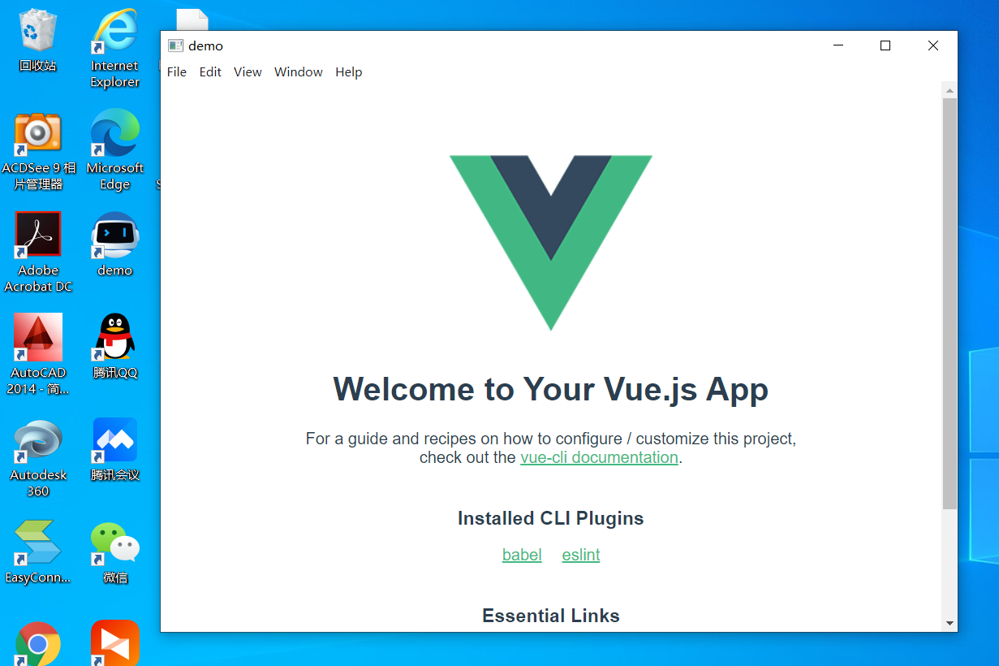

# Electron 是什么？
electron 是一个使用web前端技术来构建桌面应用的框架，它嵌入了Chromium 和 Nodejs，也就是允许你像在浏览器中一样访问项目，也可以让你通过node访问本地数据库，本地文件，实现更强大的功能
# 什么情况下我们可以使用 Electron
1.需要将web页面打包为桌面应用时
2.web端无法满足需求，需要计算机更底层的权限时
# 1. 安装
新建一个项目，或者在原项目 通过npm install --save-dev electron 安装electron最新版

npm安装不上建议通过 npm config set registry http://registry.npm.taobao.org 修改源地址
# 2. 配置
1. 安装完成后，创建electron启动文件 main.js
```js
const {app, BrowserWindow} = require('electron')

let mainWin = null
function createWindow() {
    mainWin = new BrowserWindow({
        width: 800,
        height: 600,
    })
    mainWin.loadURL('http://localhost:8080') //项目启动地址
}
// app 的ready事件触发，创建窗口
app.whenReady().then(() => {
    createWindow()
})
```
2. 修改package.json, 操作如下
    1. 配置启动文件："main": "./electron/main.js"
    2. 新增启动指令："electron": "electron ."
    ```json
    {
        ...
        "main": "./electron/main.js",
        "scripts": {
            "serve": "vue-cli-service serve",
            "build": "vue-cli-service build",
            "electron": "electron .",
            "lint": "vue-cli-service lint"
        },
        ...
        ...
    }
    ```
# 3. 启动
先启动web项目，然后执行 npm run electron，启动成功！


# 打包
打包我们使用electron-builder，

首先通过npm install electron-builder，然后在package.json中加入build配置项,
并加入打包语句
```json
{
    "script": {
        ...
        "package": "electron-builder --windows nsis:ia32"
    }
    ...
    "build": {
        "appId": "xxxx", 
        "productName": "demo",
        "copyright": "Copyright @ year ${author}", 
        "directories": {
            "output": "build" 
        },
        "asar": false, 
        "files": [
            {
                "from": "./dist",
                "to":"./"
            },
            {
                "from": "./electron",
                "to":"./electron"
            },
            "package.json"
        ],
        "win": {
            "icon": "./electron/icon.ico", 
            "artifactName": "${productName}_${version}.${ext}",
            "target": [
                {
                    "target": "nsis",  
                    "arch": [ 
                        "ia32"
                    ]
                }
            ]
        },
        "nsis": {
            "oneClick": false, 
            "guid": "xxxx", 
            "allowElevation":true,
            "allowToChangeInstallationDirectory": true, 
            "installerIcon": "./electron/icon.ico",
            "uninstallerIcon": "./electron/icon.ico", 
            "createDesktopShortcut": true, 
        }
    },
}
```
先对web项目进行打包，然后执行npm run package,

在这一步会从github中下载electron压缩包，可能会下载失败，

所以我们可以从https://npm.taobao.org/mirrors/electron淘宝镜像中下载对应的zip包，

然后复制到C:\\Users\\yourname\\.electron中,再次执行 npm run package，成功！


然后去build看看


demo_0.1.0.exe就是可执行安装包，win-ia32-unpacked就是绿色安装包

打开试试吧!然后你就会发现应用打开啦，但 <b>应用窗口是空的！</b>

这是因为我们main.js中接入的地址是http://localhost:8080,那么我们改成本地文件
1. 修改package.json中的启动语句，增加node运行环境判断
    ```json
    "electron": "set NODE_ENV=dev&&electron ."
    ```
2. 修改main.js
    ```js
    const path = require('path')
    let mainWin = null
    function createWindow() {
        mainWin = new BrowserWindow({
            width: 800,
            height: 600,
        })
        if(process.env.NODE_ENV === 'dev') {
            mainWin.loadURL('http://localhost:8080') //项目启动地址
        } else {
            mainWin.loadFile(path.join(__dirname,'../index.html'))
        }
        
    }
    ```
重新执行打包语句=> npm run package

打开build/demo_0.1.0.exe, 安装，启动！


至此简单将web项目打包成桌面应用就完成了！