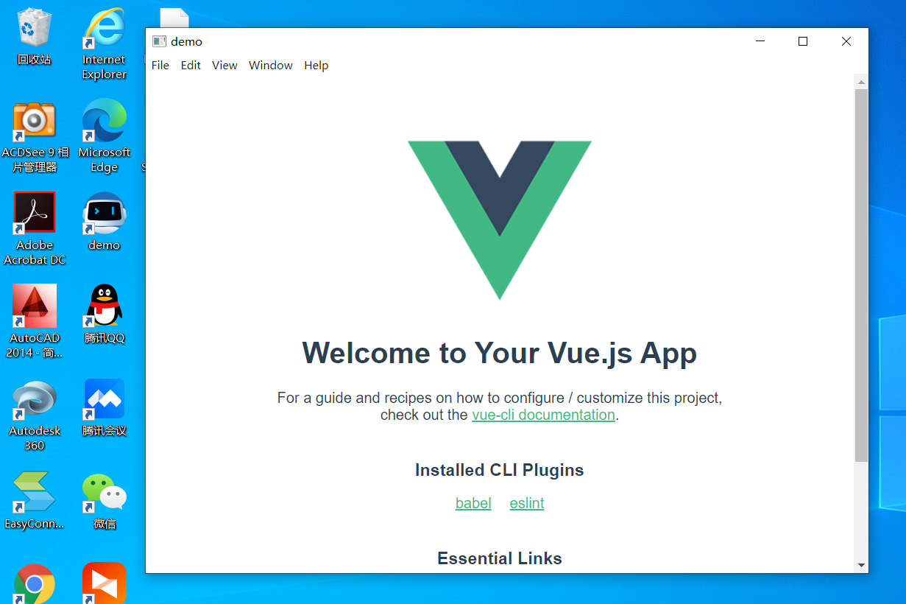
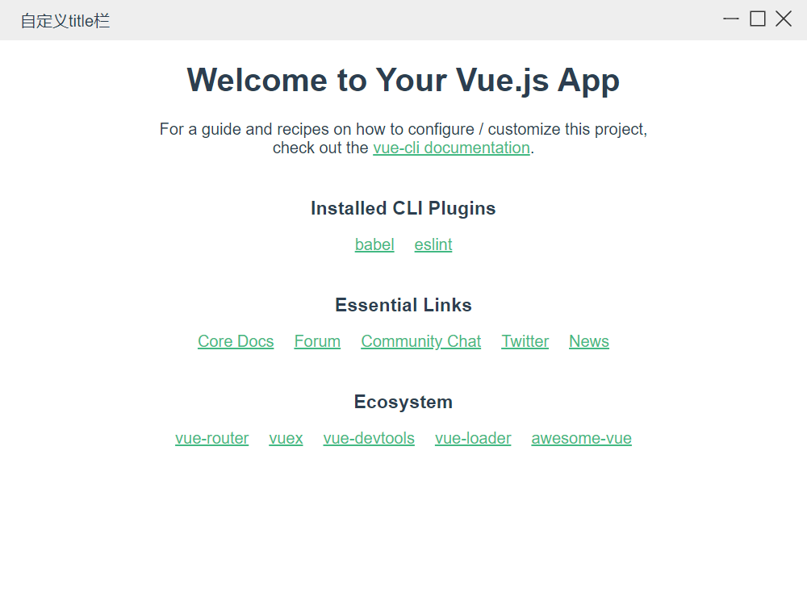

<!--
 * @Author: your name
 * @Date: 2021-09-18 10:56:31
 * @LastEditTime: 2021-09-23 13:42:10
 * @LastEditors: Please set LastEditors
 * @Description: In User Settings Edit
 * @FilePath: \electron-vue\readme\3.md
-->
# 1. 回顾
上次我们实现了将web应用打包成桌面应用，

但web应用完全独立，只是换了个浏览器展示，并且顶部的title栏不受控，所以我们可以自己写一个。
# 2.无边框及自定义title栏
首先，修改main.js中createWindow方法，使用无边框窗口，
```js
new BrowserWindow({
    width: 800,
    height: 600,
    frame: false, // 设置无边框
})
```
再次执行 npm run electron,发现边框，title栏都没了，但是无法拖拽，也没有操作按钮了，所以我们手写一个TitleBar

此时我们依然无法拖拽，接下来我们新建一个公共样式，
```css
html,
body {
    height: 100%;
    width: 100%;
    margin: 0;
    padding: 0;
    overflow: hidden;
}
.no-drag{
    -webkit-app-region: no-drag;
}
.drag {
    -webkit-app-region: drag;
}
```
给你要拖动的区域增加 drag class, 给按钮 增加 no-drag class
```html
  <div class="head-bar drag">
        自定义title栏
        <span class="no-drag">
          <i class="icon-header icon-minimize"></i>
          <i :class="['icon-header',isMax ? 'icon-restore' : 'icon-maximize']"></i>
          <i class="icon-header icon-close"></i>
        </span>
  </div>
```
这样，titlebar就可以拖拽，而3个按钮也可以点击
# 3.最大最小化实现
接下来就是最大最小化事件了，为了控制窗口，我们需要在web页面使用node模块，所以修改main.js中createWindow方法
```js
mainWin = new BrowserWindow({
    width: 800,
    height: 600,
    show: false, // 刚启动时不显示
    transparent:false, //窗口透明化，用于自定义窗口样式等，但目前与很多功能冲突，比如导致frame max无效等
    frame: false,
    webPreferences:{
        nodeIntegration: true, // 允许使用node模块
        contextIsolation: false, // 允许在web环境访问electron Api
        nativeWindowOpen: true, // 使用原生 window.open()
    }
})
// 当页面准备好后，再展示，减少启动白屏时间
mainWin.once('ready-to-show', () => {
    mainWin.show()
})
```
在TitleBar.vue中
```js
<template>
  <div class="head-bar drag">
        自定义title栏
        <span class="no-drag">
          <i @click='setWinStatus("minimize")' class="icon-header icon-minimize"></i>
          <i @click='setWinStatus(isMax?"unmaximize":"maximize")' :class="['icon-header',isMax ? 'icon-restore' : 'icon-maximize']"></i>
          <i @click='setWinStatus("close")' class="icon-header icon-close"></i>
        </span>
  </div>
</template>

<script>
import {ref, onMounted, onUnmounted } from 'vue'
/*
 * 直接使用require会报错，因为vue在构建项目时不会区分这是node语句而忽略，所以会报错
 * 使用window.requeire来防止构建时处理
 * ipcRenderer是electron中专门给渲染进程使用的模块，主要功能是实现主进程与渲染进程通信
 * 
 */
const {ipcRenderer} = window.require('electron')
export default {
    setup() {
        const isMax = ref(false)
        onMounted(() => {
            console.log('mounted')
            // 监听主进程发的消息，
            ipcRenderer.on('isMaximize',(e,payload) => {
                console.log(payload)
                isMax.value = payload
            })
        })
        onUnmounted(() => {
            ipcRenderer.removeListener('isMaximize')
        })
        const setWinStatus = (msg) => {
            // 给主进程发消息，通知主进程操作窗口
            ipcRenderer.send('setWinStatus', msg)
        }
        return {
            isMax, setWinStatus
        }
    }
}
</script>
```
然后在main.js中处理，并监听窗口变化，把是否是最大化发给渲染进程
```js
function watchSize() {
    // 通知渲染进程，窗口是否是最大化
    const sendIsMaximize = () => {
        mainWin.webContents.send('isMaximize', mainWin.isMaximized())
    }
    // 监听最大化，取消最大化，还原事件
    mainWin.on('maximize', sendIsMaximize)
    mainWin.on('unmaximize', sendIsMaximize)
    mainWin.on('restore', sendIsMaximize)
    // 接收渲染进程通过ipcRenderer传的信息，对窗口进行相关操作
    ipcMain.on('setWinStatus', (event, payload) => {
        if(payload === 'maximize') {
           mainWin.maximize()
        }else if(payload === 'minimize') {
            mainWin.minimize()
        }else if(payload === 'unmaximize') {
            mainWin.unmaximize()
        }else if(payload === 'close') {
            mainWin.close()
        }
    })
}
```
# 4.收工
现在打包出来了的应用就真正实现了混合，不再是electron嵌套一个web应用，当然web应用现在既然能使用node模块了，那类似fs这种模块就也能使用了，所以使用electron打包的web应用能比常规的网页端多出很多特性。